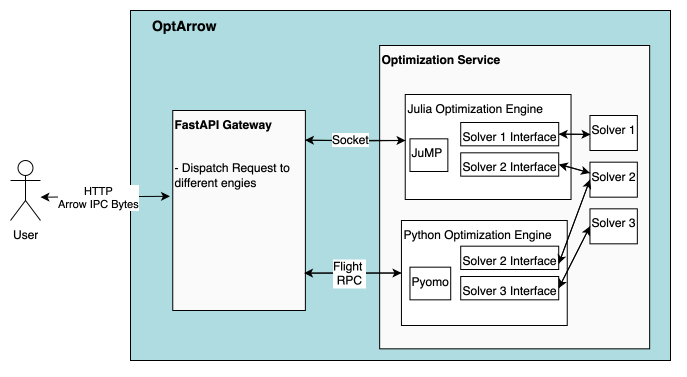

# OptArrow Documentation

Welcome to the documentation site for **OptArrow** — an optimization engine bridging Python and Julia solvers through a unified interface.


This documentation provides an overview of the OptArrow project, including its architecture and tutorials to help you get started with optimization tasks.


## Architecture Overview


The architecture of OptArrow is designed to facilitate seamless communication between Python and Julia optimization solvers. It consists of the following key components:

1. **Gateway**: The entry point for all optimization requests. It handles incoming requests, manages sessions, and routes tasks to the appropriate solver. It also provides a unified interface that abstracts the differences between Python and Julia, allowing users to switch between solvers with minimal code changes.

2. **Python Engine**: It serves as the Python-based optimization engine, leveraging libraries like Pyomo. It uses Apache Arrow Flight RPC for efficient data transfer and communication with the Gateway. This engine is designed to handle various optimization tasks, including linear programming (LP) and quadratic programming (QP).

3. **Julia Engine**: Similar to the Python Engine, but specifically for Julia-based optimization libraries (e.g., JuMP). It leverages Julia's performance advantages for solving complex optimization problems. This engine also communicates with the Gateway using socket-based TCP connections and Apache Arrow IPC bytes as the data format, ensuring efficient data exchange between the Julia environment and the Gateway.

These three services can be run independently, allowing for flexible deployment and scaling. The Gateway acts as the central hub, coordinating requests and responses between the Python and Julia engines.
For installation and setup instructions, please refer to the [Installation Guide](installation.md) and [Julia Setup Guide](julia_setup.md).

---


```{toctree}
:hidden:
:maxdepth: 1
:caption: Tutorials

tutorials/lp_problem
tutorials/lp_example1
tutorials/lp_example2


tutorials/qp_problem
tutorials/qp_example